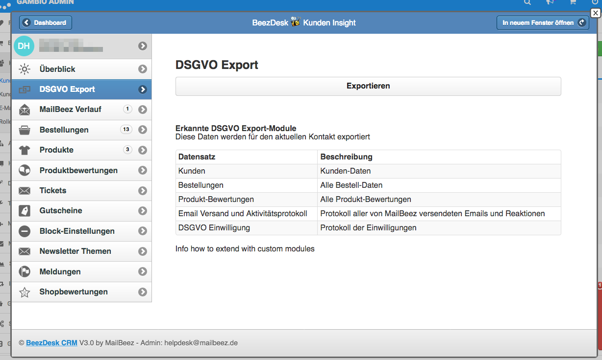

---
# http://learn.getgrav.org/content/headers
title: DSGVO Export System
slug: config_gdpr_export
# menu: Antispam Regeln
date: 24-05-2018
published: true
publish_date: 24-05-2018
template: docs
# theme: false
visible: true
summary:
    enabled: true
    format: short
    size: 128
taxonomy:
    migration_status: done
    category: [docs]
    tag: [core]
# added collection selector

author:
    name: admin
metadata:
    author: admin
#      description: Your page description goes here
#      keywords: HTML, CSS, XML, JavaScript
#      robots: noindex, nofollow
#      og:
#          title: The Rock
#          type: video.movie
#          url: http://www.imdb.com/title/tt0117500/
#          image: http://ia.media-imdb.com/images/rock.jpg
#  cache_enable: false
#  last_modified: true
---

Das MailBeez DSGVO Export System unterstützt die Anforderungen der DSGVO, Kunden auf Anfrage alle gespeicherten Daten zur Verfügung stellen zu können.

Als Erweiterung zum [BeezDesk Kunden-Insight](/dokumentation/configbeez/config_customer_insight) können Sie hiermit schnell und einfach einen Export aller relevanten Daten im CSV-Format erstellen.

Das System ist modular aufgebaut und kann durch einen Programmierer leicht erweitert werden, um z.B. Daten aus einem externen System in den Export zu integrieren (weiter Informationen hierzu folgen).

