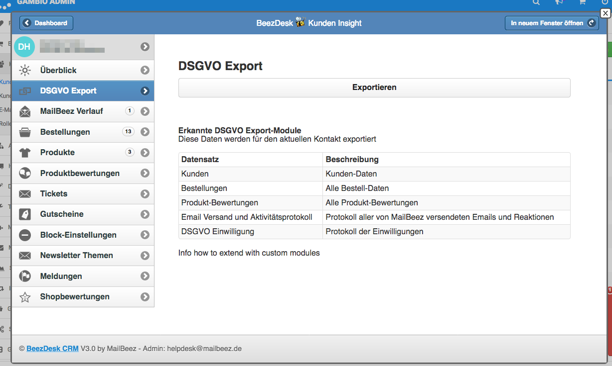

GDPR Export Framework

The MailBeez GDPR Export Framework matches the GDPR requirements to export on request all stored data for a customer contact.

This extension for the [BeezDesk Customer-Insight](/documentation/configbeez/config_customer_insight) allows your to easily export all data for a customer contact in CSV format.

The GDPR Export Framework is extensible so a programmer can easily integrate data form an external system into the export (details will follow).