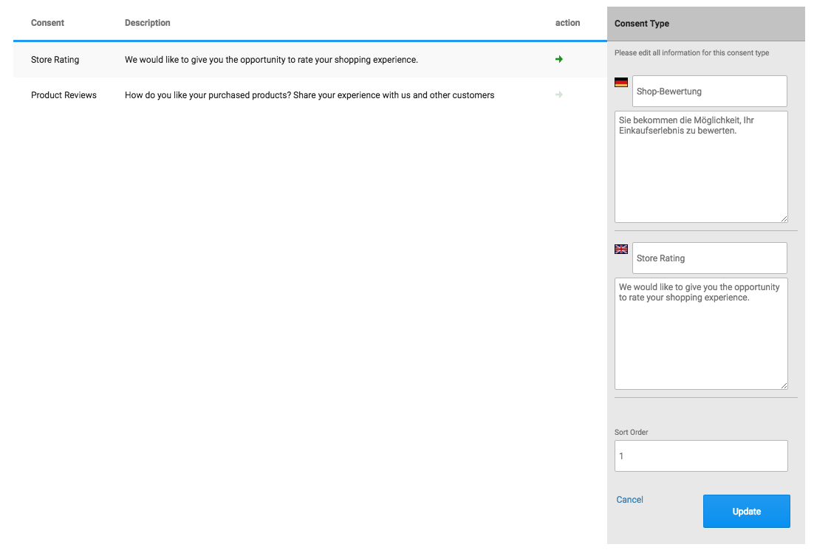
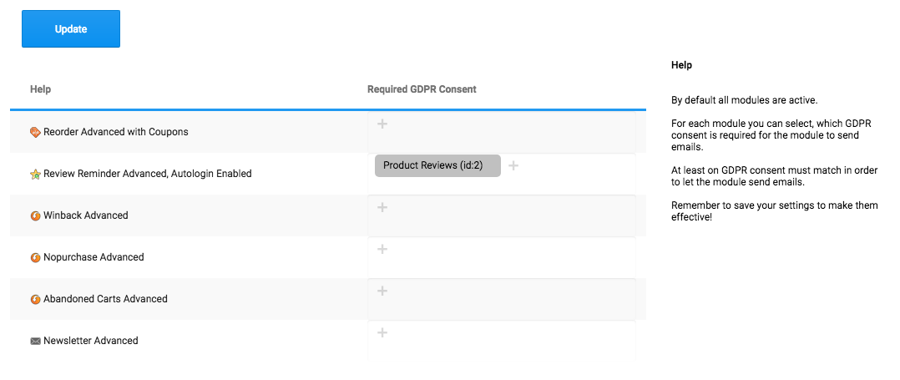

The GDPR Consent module allows you to comply with requirements for custom consents, which might be necessary in some regions.

## Configuration of GDPR consent types

In `MailBeez > Configuration > GDPR Consent` you can edit the types of GDPR consents. By default you will find a consent for Store ratings and a consent for product ratings.

In `MailBeez > Filter & Helpers > GDPR Consent Check` you can configure for each module, which consent must be given in order to send an email.

### Consent form integration

The order confirmation page is a great place to ask the customer for consent to follow up. You can place a button there, which links to the consent confirmation page.

The following code example shows how to generate the URL to the configuration page

    include_once(<YOUR_PATH> . 'mailhive/configbeez/config_gdpr_consent/includes/inc.gdpr_consent.php');
    
    $template_cfg = 'myPage'; // /mailhive/configbeez/config_gdpr_consent/views/consent/templates/myPage.tpl.html
    $tmpl_vars = array('mySetting' => 'Hey'); // can be used as {$mySetting} in myPage
    $set_consent_type_id = 1; // with visiting the url this consent is automatically given and stored - use with care!

    $url = mh_gdpr_render_configuration::get_consent_configuration_url(array(
        'customer_id' => $customer_id,
        'email_address' => $email_address,
        'cfg_template' => $template_cfg,
        'cfg_data' => $tmpl_vars,
        'set_consent_type_id' => $set_consent_type_id));

Check if consent is missing

    if (mh_gdpr_consent::checkMissingConsent($customer_id)) {
        // at least one consent is missing
        // output button
    }

### Custom configuration page

The default template file is located in

    /mailhive/configbeez/config_gdpr_consent/views/consent/templates/default_consent_configuration.tpl.html

This file will be overwritten (as with all `default_` files ) with any MailBeez update. For creating a custom template please copy this file and rename to `consent_configuration.tpl.html` by removing the `default_` prefix

You find more information how to customize this template in the template code.

### Email Template Placeholder

The placeholder

`[[$gdpr_configuration]]`

returns the custom url linking to the configuration page of the current customer.

