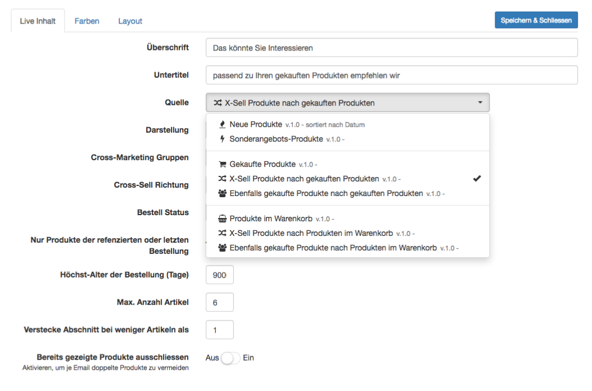

Im visuellen Editor können Sie schnell und einfach regelbasierte **personalisierte Produkt-Empfehlungen** in jede MailBeez Email einfügen.

Hierzu das Inhalts-Element `Live Content` wählen und dann wie gewünscht konfigurieren.

#### Katalog-basierte Produkt-Empfehlungen

**Top Produkte**  
 Hiermit werden die im Shop als "Top" Produkte markierten Artikel aufgelistet

**Neue Produkte**  
 Zeigt die konfigurierte Anzahl an neuen Produkte an, sortiert nach Datum

**Sonderangebote**  
 Zeigt die konfigurierte Anzahl an Sonderangebots-Produkten an

#### Produkt-Empfehlungen nach gekauften Produkte

**XSell-Produkte nach gekauften Produkten**  
 Zeigt XSell-Produkte an, basieren auf den vom Kunden zuvor gekauften Produkte

**Ebenfalls gekaufte Produkte nach gekauften Produkten**  
 Zeigt Produkte, welche von anderen Kunden gekauft wurden, welche zuvor gleiche Produkte gekauft hatten.

#### Produkt-Empfehlungen nach Warenkorb
**Produkte im Warenkorb**  
 Zeigt den aktuellen Warenkorb

**XSell-Produkte nach Produkten im Warenkorb**  
 Zeigt XSell-Produkte passenden zu den Produkten im Warenkorb

**Ebenfalls gekaufte Produkte nach Produkten im Warenkorb**  
 Zeigt Produkte, welche von anderen Kunden gekauft wurden, welche ebenfalls die Produkte im Warenkorb gekauft haben.

Je nach gewählter Quelle stehen weitere Konfigurations-Möglichkeiten zur Verfügung, diese sollten sich selbst erklären.

#### Keine doppelten Produkte
Sie können gerne mehrere Inhalts-Elemente vom Typ `Live Content` einfügen - mit der Option "**Bereits gezeigte Produkte ausschliessen**" können Sie sicher sein, dass keine doppelten Produkte erscheinen, falls z.B. eine Neuheit auch gleichzeigtig ein Sonderangebot ist und sowohl `Live Content` vom Typ "Neue Produkte" als auch "Sonderangebote" eingefügt wurden.

#### FSK18- und Gruppen-Check
In den Shop-Systemen **Modified-Shop** und **Gambio** können Produkte mit FSK18- und Gruppen-Berechtigungen versehen werden. Standardmässig berücksichtigt der Inhalts-Generator diese Berechtigungen, so dass nur für den Kunden passende Produkte vorgeschlagen werden. Optional kann dieser Check deaktiviert werden. In anderen Shopsystem steht diese Konfigurationsmöglichkeit nicht zur Verfügung.

