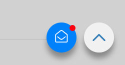
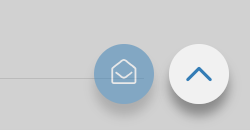

---
# http://learn.getgrav.org/content/headers
title: Newsletter Anmeldung
slug: site_signup
date: 28-06-2018
published: true
publish_date: 28-06-2018
template: docs
# theme: false
visible: true
summary:
    enabled: true
    format: short
    size: 128
taxonomy:
    migration_status: done
    category: [docs]
    tag: [pro]
module:
    code: 'site_signup'
    category: [sitebeez]
    compatiblity: [comp_osc,comp_cre,comp_digi,comp_zencart,comp_xtc,comp_xtcm2,comp_gambio,comp_saas]
    pro: 'pro'

# added collection selector

author:
    name: admin
metadata:
    author: admin
#      description: Your page description goes here
#      keywords: HTML, CSS, XML, JavaScript
#      robots: noindex, nofollow
#      og:
#          title: The Rock
#          type: video.movie
#          url: http://www.imdb.com/title/tt0117500/
#          image: http://ia.media-imdb.com/images/rock.jpg
#  cache_enable: false
#  last_modified: true
---

Mit dem Newsletter Widget können Sie Email-Adressen von Interessenten, aber auch Einwilligungen von bereits bestehenden Kunden erfassen.

Das Widget ist nahtlos mit dem [MailBeez Newsletter Modul](/dokumentation/mailbeez/newsletter) integriert, so dass Sie dort die Emails zum Doppel-Optin und Willkommens-Email - ggf. mit Gutschein - bearbeiten können. Falls die entsprechenden Untermodule nicht angezeigt werden, bitte in der Konfiguration des MailBeez Newsletter Modules die Option `Optin / Bestätigungs-Module aktivieren` auf `True` setzen.

Nach Integration (wird weiter unten beschrieben) bettet sich der Button in die Webseite ein und zieht dezent Aufmerksamkeit auf sich:

Mit Klick auf den Button öffnet sich das responsive Anmelde-Formular und führt den Besucher durch den Registrierungs-Ablauf:

Nach einmaligem Öffnen des Dialoges bleibt der Button weiterhin - aber weniger interessant - sichtbar:

## Integration

Die Integration erfolgt über asynchronen, leichtgewichtigen JavaScript-Code und kann somit auf jeder Webseite (im Shop, Shopgate, Wordpress Blog, Google Tag Manager) eingebunden werden.

Den Integrations-Code finden Sie unter `MailBeez > Konfiguration > SiteBeez` - dort den Code kopieren und im Zielsystem einfügen.

In Gambio kann der Code unter `Shopeinstellungen > SEO > Trackingcode > Tracking-Code (Body)` eingefügt werden - danach den Seiten-Cache leeren.

### CSS

Die Position und Darstellung des Buttons kann über CSS anpasst werden. Der CSS Code muss in das Template des Shops eingefügt werden.

In Gambio kann der CSS Code über den Style Editor eingefügt werden. Hierzu `Darstellung > Template Einstellungen > Style Edit "Theme bearbeiten"` aufrufen und dann oben rechts das erweiterte Menü anlicken:

Unter `SCSS/CSS bearbeiten`  kann dann der eigene CSS Code eingefügt werden.

Nachfolgend einige grundlegende Beispiele zur Anpassung:

**Position ändern**

Mit folgendem CSS Code kann der Button unten links angezeigt werden.

    div.stbz_container {
        left: 100px !important;
        right: inherit !important;
        bottom: 100px !important;
    }

**Farbe des Buttons - noch nicht geklickt**

    .stbz_button {
        background-color: #ff0000 !important;
    }

**Farbe des Buttons - geklickt**

    .stbz_button.stbz_displayed {
            background-color: #c0c0c0 !important;
    }

## Eigener Button

In der Standard-Konfiguration wird der Button im Gambio-Design eingebunden:

     var w = "button_float";

Um einen eigenen Button zu verwenden, bitte den JavaScript Code wie folgt abändern:

     var w = "custom_code";

und im html Code der Seite ein Element mit `data-sitebeez-trigger="custom_code"` einfügen, wie das folgende Beispiel zeigt:

    
my custom button

Mit Klick auf dieses Element öffnet sich dann der Registrierungs-Dialog. Der Html-Code kann nach eigenem Ermessen angepasst werden.

## Anmelde-Formular direkt öffnen

Das Anmelde-Formular kann über folgende URL direkt geöffnet werden:

    <server-url>mailhive.php?m=mb_newsletter&ma=signup

Um eine Email-Adresse zu übergeben, diese als Parameter `email` wie folgt an die URL hängen:

    <server-url>mailhive.php?m=mb_newsletter&ma=signup&email=test@test.com

Es können auch eine oder mehrere Ids von zuvor angelegten Themenbereichen übergeben werden, so dass die Email-Adresse automatisch den Themenbereich zugeordnet werden können:

    <server-url>mailhive.php?m=mb_newsletter&ma=signup&email=test@test.com&topics=3,9

Ein typischer Anwendungsfall: Nach Registrierung wird dem Empfänger ein bestimmter Inhalt per Email geschickt. Hierzu in der Liste nach dem gewünschten Themenbereich segmentieren.

## Anpassungen

>>>>> Dies ist aktuell nicht in der GambioCloud möglich.

Folgende Schritte gelten für alle Dialoge unterhalb

`ext/mailhive/mailbeez/mb_newsletter/views`

### Anpassung der Dialoge

Alle Dialoge sind als Views in Smarty Templates hinterlegt, zur Anpassung des Anmelde-Dialogs die Datei

`ext/mailhive/mailbeez/mb_newsletter/views/signup/templates/default_signup.tpl.html`

nach

`ext/mailhive/mailbeez/mb_newsletter/views/signup/templates/signup.tpl.html` (also ohne "default_")

kopieren und anpassen.

### Anpassung der Text-Elemente und Übersetzungen

in den Dialogen wird über die Zeile

`{config_load file="$language.conf" section="signup"}`

die jeweils passende Sprach-Datei aus

`ext/mailhive/mailbeez/mb_newsletter/views/signup/languages/`

geladen.

Mit einer Änderung auf `{config_load file="$language.myconf" section="signup"}` (also `myconf` statt `conf`)

wird eine eigene Sprachdatei wie `german.myconf` geladen.

