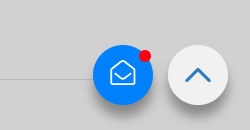
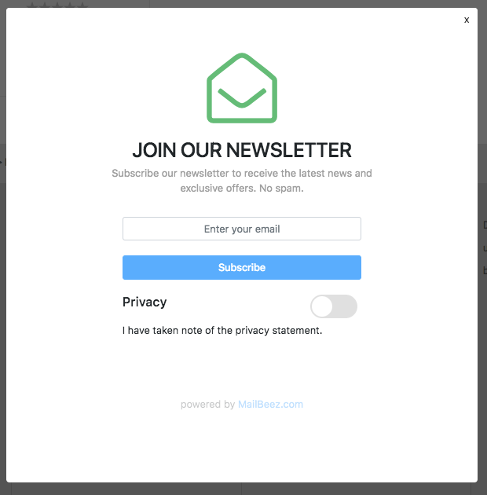
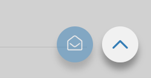

---
# http://learn.getgrav.org/content/headers
title: Newsletter Registration
slug: site_signup
date: 28-06-2018
published: true
publish_date: 28-06-2018
template: docs
# theme: false
visible: true
summary:
    enabled: true
    format: short
    size: 128
taxonomy:
    migration_status: done
    category: [docs]
    tag: [pro]
module:
    code: 'site_signup'
    category: [sitebeez]
    compatiblity: [comp_osc,comp_cre,comp_digi,comp_zencart,comp_xtc,comp_xtcm2,comp_gambio]
    pro: 'pro'

# added collection selector

author:
    name: admin
metadata:
    author: admin
#      description: Your page description goes here
#      keywords: HTML, CSS, XML, JavaScript
#      robots: noindex, nofollow
#      og:
#          title: The Rock
#          type: video.movie
#          url: http://www.imdb.com/title/tt0117500/
#          image: http://ia.media-imdb.com/images/rock.jpg
#  cache_enable: false
#  last_modified: true
---

>>>>> BETA: The present version is a first BETA edition but has been developed and tested with great care. There are still missing important functions such as the design adaptation and editing of the texts.

With the Newsletter Widget you can capture the email addresses of prospects as well as the consent of existing customers.

The widget is seamlessly integrated with the [MailBeez Newsletter Module] (/documentation/mailbeez/newsletter), so that you can edit the content for the double-optin and welcome email - possibly with a voucher. If the corresponding submodules are not displayed, please set the option `Activate Optin / Confirmation Modules` to` True` in the configuration of the MailBeez Newsletter Module.

After integration (described below), the button embeds itself into the website and attracts attention discreetly:

Clicking on the button opens the responsive registration form and guides the visitor through the registration process:

After opening the dialog once, the button remains visible - but less interesting - visible:

## Integration

The integration takes place via asynchronous, lightweight JavaScript code and can thus be integrated on any website (Shop, Shopgate, Wordpress Blog, Google Tag Manager).

The integration code can be found under `MailBeez > Configuration > SiteBeez` - there you can copy the code and paste it into the target system.

In Gambio the code can be inserted under `Shop Settings > SEO > Trackingcode`.

## Custom Button

In the present beta version the shown button is available in Gambio design:

     var w = "button_float";

To use a custom button, please modify the JavaScript code as follows:

     var w = "custom_code";

and insert an element with `data-sitebeez-trigger="custom_code"` in the html code of the page, as the following example shows:

    
my custom button

Click on this element to open the registration dialog. Please customize the html code to match your needs.
