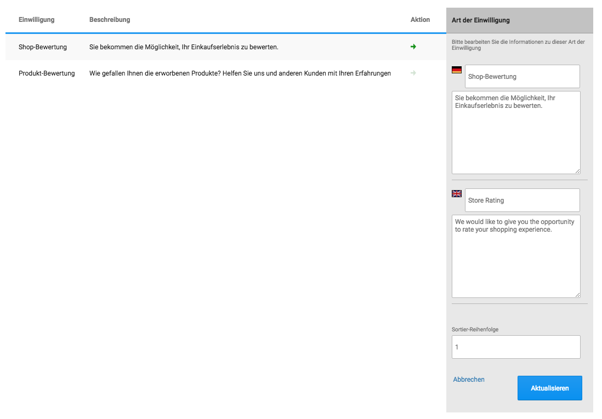
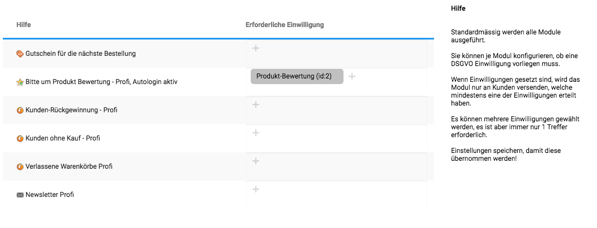
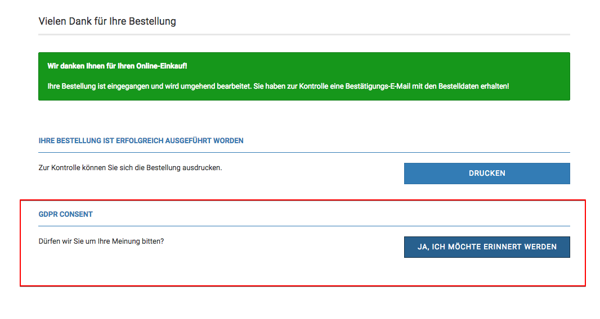
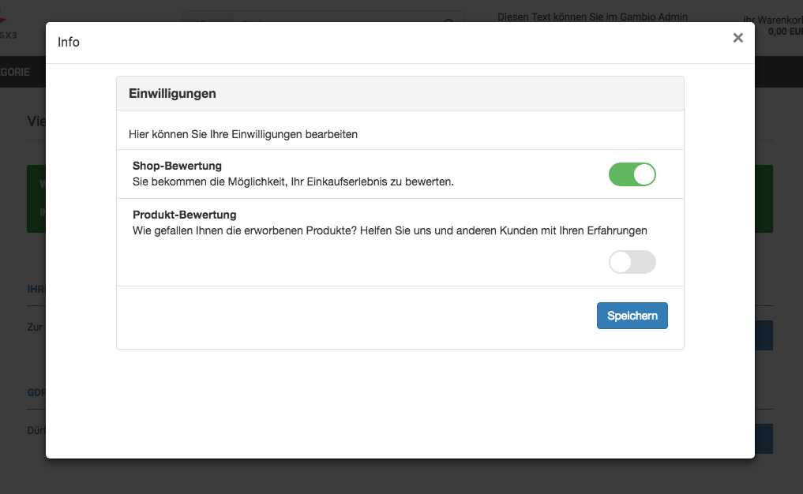

---
# http://learn.getgrav.org/content/headers
title: DSGVO Einwilligungen
slug: config_gdpr_consent
# menu: Antispam Regeln
date: 24-05-2018
published: true
publish_date: 24-05-2018
template: docs
# theme: false
visible: true
summary:
    enabled: true
    format: short
    size: 128
taxonomy:
    migration_status: done
    category: [docs]
    tag: [pro]
module:
    code: 'config_gdpr_consent'
    category: [configbeez]
    compatiblity: [comp_osc,comp_cre,comp_digi,comp_zencart,comp_xtc,comp_xtcm2,comp_gambio,comp_saas]
    thumbnail: 'http://www.mailbeez.com/wp-content/uploads/downloads/thumbnails/2014/04/icon_32.png'
    pro: 'pro'
    cert: 'true'
# added collection selector

author:
    name: admin
metadata:
    author: admin
#      description: Your page description goes here
#      keywords: HTML, CSS, XML, JavaScript
#      robots: noindex, nofollow
#      og:
#          title: The Rock
#          type: video.movie
#          url: http://www.imdb.com/title/tt0117500/
#          image: http://ia.media-imdb.com/images/rock.jpg
#  cache_enable: false
#  last_modified: true
---

Mit dieser Erweiterung können Sie flexibel Ihre eigenen Anforderungen an die Einholung und Verwendung von DSGVO Einwilligungen umsetzen. Welche Einwilligungen Sie für erforderlich halten, hängt von der Interpretation der Gesetzgebung ab.

Alle Einwilligungs-Aktionen des Kunden werden protokolliert und können über das [DSGVO Export System](/dokumentation/configbeez/config_gdpr_export) belegt werden.

## Konfiguration der DSGVO Einwilligungen

Unter `MailBeez > Konfiguration > DSGVO Einwilligung` können Sie die Arten der Einwilligungen bearbeiten - standardmässig finden Sie dort bereits eine Einwilligung für Shop-Bewertungen und eine Einwilligung für Produkt-Bewertungen.

Unter `MailBeez > Filter & Hilfsmodule > DSGVO Einwilligungs-Prüfung` können Sie dann je Email-Modul konfigurieren, welche DSGVO Einwilligung vorhanden sein muss:

## Integration der Abfrage zur Einwilligung

### Gambio GX3

#### Installation des Overloads
Die Integration zur Abfrage von Einwilligungen in die Checkout-Success Seite erfolgt mittels Update-sicherem Overload.

Bitte die [Overload Datei downloaden](http://mailbeez-support.com/cloudfiles/integrations/GDPR/gambio/MailBeezGdprConsentCheckoutSuccessExtender.txt), die Endung von `.txt` nach `.php` ändern und im Gambio System per FTP unter

    /system/overloads/CheckoutSuccessExtenderComponent/MailBeezGdprConsentCheckoutSuccessExtender.php

hochladen.

Unter `Toolbox > Cache > Cache für Modulinformationen leeren` ausführen - danach wird dann die Abfrage zur Einwilligung auf der Checkout-Success Seite eingebunden:

Die Abfrage wird nur eingebunden, falls der Kunde noch nicht alle Einwilligungen gegeben hat.

Mit Klick auf den Button öffnet sich der Konfigurations-Dialog

#### Anpassung der Abfrage-Integration

Die Standard-Vorlage für die Einbindung auf der CheckoutSuccess Seite finden Sie unter:

    /mailhive/configbeez/config_gdpr_consent/views/shop_integration/templates/default_gambio_checkoutsuccess.tpl.html

Diese Datei wird - wie alle `default_` Dateien im MailBeez System - bei Updates überschrieben. Um eine eigene Vorlage anzulegen, bitte die Datei kopieren und den Prefix `default_` entfernen. Im Quellcode der Datei finden Sie weitere Hinweise zur Anpassung.

Um die Sprach-Konstanten anzupassen, bitte eine eigene Vorlage anlegen und den Pfad zu eigenen Sprach-Dateien ändern.

### Anpassung der Konfigurations-Seite

Die Standard-Vorlage für die Seite zur Konfiguration der Einwilligungen finden Sie unter:

    /mailhive/configbeez/config_gdpr_consent/views/consent/templates/default_consent_configuration.tpl.html

Diese Datei wird - wie alle `default_` Dateien im MailBeez System - bei Updates überschrieben. Um eine eigene Vorlage anzulegen, bitte die Datei kopieren und den Prefix `default_` entfernen. Im Quellcode der Datei finden Sie weitere Hinweise zur Anpassung.

Um die Sprach-Konstanten anzupassen, bitte eine eigene Vorlage anlegen und den Pfad zu eigenen Sprach-Dateien ändern.

### Link zur Einwilligungs-Seite in MailBeez Emails

Sie können mit Hilfe des Platzhalters

`[[$gdpr_configuration]]`

 einen Link zur DSGVO Konfigurations-Seite des jeweiligen Kunden in MailBeez Emails einbinden. Mit Klick auf den Link gelangt der Kunde dann direkt zur Konfigurations-Seite.

### Eigene Einbindungen

der URL zur Konfigurations-Seite kann wie folgt personalisiert im PHP Code generiert werden:

    include_once(<YOUR_PATH> . 'mailhive/configbeez/config_gdpr_consent/includes/inc.gdpr_consent.php');
    
    $template_cfg = 'myPage'; // /mailhive/configbeez/config_gdpr_consent/views/consent/templates/myPage.tpl.html
    $tmpl_vars = array('mySetting' => 'Hey'); // can be used as {$mySetting} in myPage
    $set_consent_type_id = 1; // with visiting the url this consent is automatically given and stored - use with care!

    $url = mh_gdpr_render_configuration::get_consent_configuration_url(array(
        'customer_id' => $customer_id,
        'email_address' => $email_address,
        'cfg_template' => $template_cfg,
        'cfg_data' => $tmpl_vars,
        'set_consent_type_id' => $set_consent_type_id));

Mit folgender Logik können Sie prüfen, ob es nicht erteilte Einwilligungen gibt:

    if (mh_gdpr_consent::checkMissingConsent($customer_id)) {
        // at least one consent is missing
        // output button
    }

