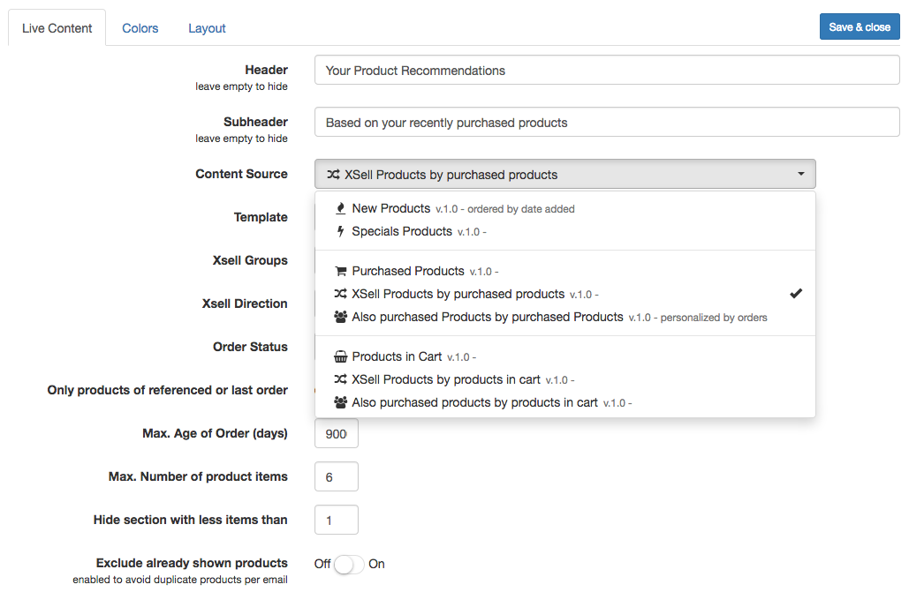

Adds rulebased **personalised product recommendations** to any MailBeez Email.

When editing an email template just add the content element `Live Content` and configure the settings to add product recommendations.

You can select from the following choice of content sources which define how recommendations are retrieved.
Depending on the selected content source you will find a number of configuration options.

>>>>>>For order related recommendations (e.g. "also purchased") please configure the relevant order status and the timeframe of the orders to use for retrieving recommendations. This allows you to configure how fast the **seasonal buying behaviour** influences the recommendations.

#### Catalog-based product recommendations 

**Featured Products**  
 Shows the products marked as "featured"

**New Products**  
 Shows the configured number of new product items, sorted by date

**Specials Products**  
 Shows the configured number of special product items, sorted by date

#### Product recommendations by purchased products
**XSell-Product by purchased products**  
 Shows xsell products based on previously purchased products

**Also purchased products by purchased products**  
 Shows also purchased products based on previously purchased products

#### Product recommendations by products in cart
**Products in Cart**  
 Shows the products in cart

**XSell-Products by products in cart**  
 Shows xsell products based on products in cart

**Also purchased products by products in cart**  
 Shows also purchased products based on products in cart

>>>>> **Zen-Cart:** XSell bases sources will only be available with the installed addon [Cross Sell Advanced](https://www.zen-cart.com/downloads.php?do=file&id=400)

#### Unique products only
You can add multiple content elements of type `Live Content` - just active the option "**Exclude already shown products**" to make sure only unique products are shown, e.g. in case a product is both new and a specials products and you have added both `Live Content` of type "New Products" and "Specials Products"

#### FSK18- and Group-Check
The store systems **Modified-Shop** and **Gambio** allow to tag products with "FSK18" and "group" permissions. By default the content engine will respect these settings to make sure only appropriate products are recommended. If you like you can deactivate this setting.
On other store systems this configuration option is hidden.

