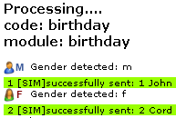

---
# http://learn.getgrav.org/content/headers
title: Geschlechtsabhängige Inhalte
slug: filter_add_gender
# menu: Geschlechtsabhängige Inhalte
date: 08-04-2011
published: true
publish_date: 08-04-2011
# unpublish_date: 08-04-2011
template: docs
# theme: false
visible: true
summary:
    enabled: true
    format: short
    size: 128
taxonomy:
    migration_status: done
    category: [docs]
    tag: [pro]
module:
    code: 'filter_add_gender'
    category: [filterbeez]
    compatiblity: [comp_osc,comp_cre,comp_digi,comp_zencart,comp_xtc,comp_gambio]
    pro: 'pro'
    cert: 'true'
# added collection selector

author:
    name: admin
metadata:
    author: admin
#      description: Your page description goes here
#      keywords: HTML, CSS, XML, JavaScript
#      robots: noindex, nofollow
#      og:
#          title: The Rock
#          type: video.movie
#          url: http://www.imdb.com/title/tt0117500/
#          image: http://ia.media-imdb.com/images/rock.jpg
#  cache_enable: false
#  last_modified: true
---

Mit diesem Modul können die MailBeez generierte Emails and das Geschlecht des Kunden / der Kundin angepasst werden.

Diese Funktion steht nach Installation in allen offiziellen MailBeez Email Kampagnen Modulen zur Verfügung.

Aufgrund der nahtlosen Integration in das MailBeez System können Sie z.B. das Geschlecht beim Senden von Test-Emails auswählen – sehr sinnvoll bei der Entwicklung und dem Testen von Email Kampagnen mit geschlechtsspezifischen Inhalten.


Zur Kontrolle wird das erkannte Geschlecht des Kunden beim Versand angezeigt:  



In Email-Vorlagen können Sie mit etwas Logik wie folgt unterschiedliche Inhalte nach Geschlecht ausgeben:

```
{if $gender == "f"}
   Sehr geehrte Frau {$lastname}
{elseif $gender == "m"}
   Sehr geehrter Herr {$lastname}
{else}
   Hallo {$firstname} {$lastname}
{/if}

```

bzw. mit Tags im visuellen Editor:

```
[[if $gender == "f"]]
   Sehr geehrte Frau [[$lastname]]
[[elseif $gender == "m"]]
   Sehr geehrter Herr [[$lastname]]
[[else]]
   Hallo [[$firstname]] [[$lastname]]
[[/if]]

```


Dies beschränkt sich nicht nur auf die Anrede, ganze Inhalts-Abschnitte - auch in der gemeinsamen Hauptvorlage - können somit personalisiert werden.