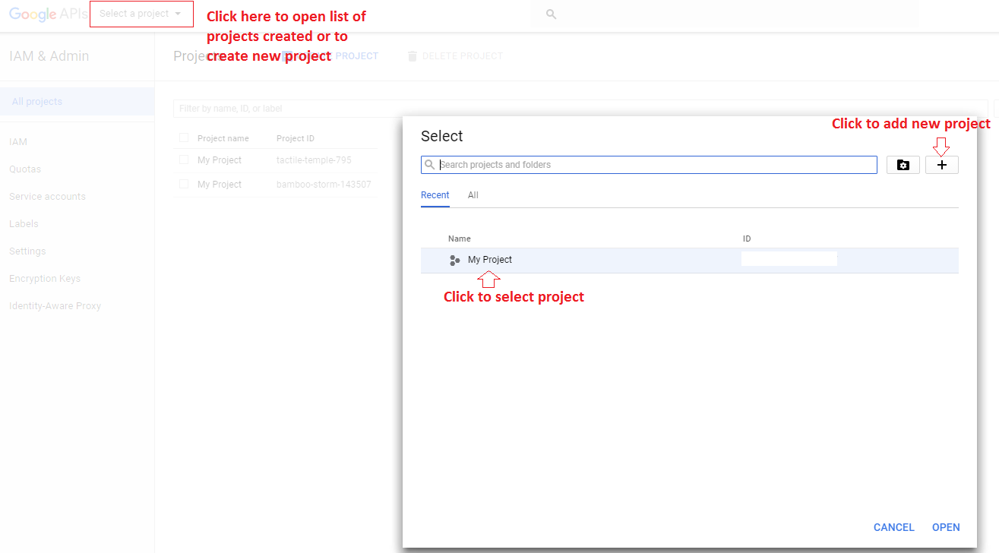
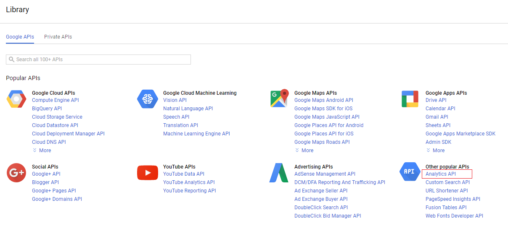
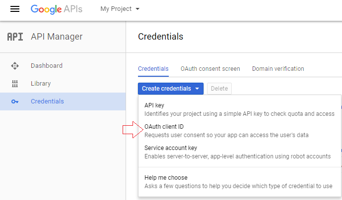
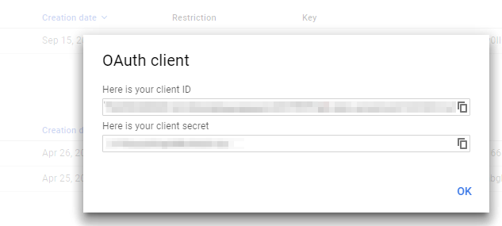
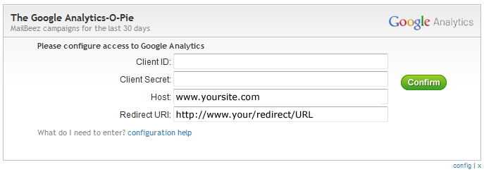
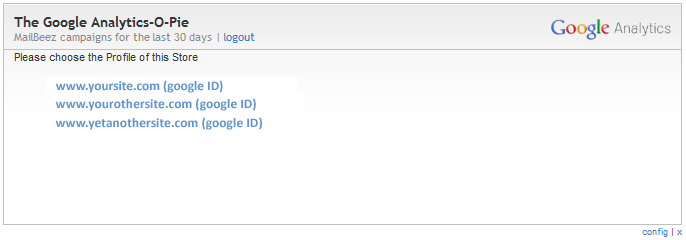

---
# http://learn.getgrav.org/content/headers
title: The Google Analytics O'Pie
slug: dashboard_ga
# menu: The Google Analytics O'Pie
date: 07-05-2012
published: true
publish_date: 07-05-2012
# unpublish_date: 07-05-2012
template: docs
# theme: false
visible: true
summary:
    enabled: true
    format: short
    size: 128
taxonomy:
    migration_status: done
    category: [docs]
    tag: [core]
# added collection selector

author:
    name: admin
metadata:
    author: admin
#      description: Your page description goes here
#      keywords: HTML, CSS, XML, JavaScript
#      robots: noindex, nofollow
#      og:
#          title: The Rock
#          type: video.movie
#          url: http://www.imdb.com/title/tt0117500/
#          image: http://ia.media-imdb.com/images/rock.jpg
#  cache_enable: false
#  last_modified: true
---

Delivered with the MailBeez framework, the Google-Analytics-O-Pie is a powerful widget that provides you with a visual report in the form of a pie chart of all the MailBeez activity data that Google Analytics tracks for you, such as site visits resulting from MailBeez email campaigns, revenue earned with MailBeez, and a breakdown of that revenue by module so that you can see which modules are working hardest for you!

>>>>>You must have a Google Analytics account set up and have it activated & configured in MailBeez for this widget to function.
 

#### Common Questions

**Why does the Google Analytics data differ from MailBeez Analytics data?**

Google Analytics can only track orders made after clicking a direct link in a MailBeez generated email, so for example, if a customer receives a MailBeez coupon email on his mobile device, but then later places his order using his desktop computer by simply typing in the discount code from the email, the Google Analytics connection to the MailBeez Email is lost.

Conversely, any orders made using MailBeez generated coupons will be tracked by MailBeez Analytics whether the customer clicks the link in the email or manually enters the coupon code from the email during checkout.

**Why do I have such few clicks recorded in Google Analytics?**

Some stores do not have Google Analytics tracking on their store-front. When your MailBeez emails contain a link to the store-front, these visits, (and the resulting purchases), won’t be recorded by Google Analytics.  
  

## Using the Google Analytics Dashboard Widget

Due to changes Google has made to the Google Analytics API, the way the MailBeez Google Analytics Dashboard Widget works has changed. There is a new process that must be followed in order for your widget to access & display your Google Analytics data.

We have created a step-by-step tutorial for you to make it easier.

### Step 1: Set up the Google API Project

1. Navigate to: <https://code.google.com/apis/console/> and sign in to your Google account

2. If this is your first time here, a “Create Project” button will appear. Click it. 
If you have already created projects then you can select from them.

4. Once you will select project, you will redirect to Project Dashboard. From there you can click on Enable API:
Click on Analytics API and Enable it.
  
  
 
7. Select “Credentials” from the menu at left to generate Credentials, Click on Create Credentials and select "OAuth Client ID":

9. You will be ask to fill up Application Type, Name, Origin URL and Redirect URL:  
 **Application Type** - Select "Web Application"  
 **Name**- MailBeez Application  
 **Authorized Javascript Origin** - remove “https://www.example.com” and replace it with the URL shown in your Google Analytics Dashboard Widget  
 **Authorized Redirect URL** - remove “https://www.example.com/oauth2callback” and replace it with the URL shown in your Google Analytics Dashboard Widget  
 Then Click on "Create" button

10. You will get popup with client ID and client secret. 
The API Setup is now complete and the information you need to configure your dashboard widget is visible:

22. To complete the next step, you will need the Client ID and the Client Secret from this screen

### Step 2: Configure the Dashboard Widget

1. Navigate to the Google Analytics Dashboard Widget on your MailBeez Dashboard:

3. Enter the the Client ID and the Client Secret from the Google API Console & click the “Confirm” button

4. Click the “Connect” button to connect your widget to your Google account:

6. If you’re not signed in to your Google account, you will be redirected to a Google login screen. Enter your login information to be redirected to the Google Authentication screen.

7. If you are already logged in to your Google account, you will be immediately redirected to the Google authentication screen:

9. Click the “Allow Access” button and you’ll be redirected back to your MailBeez Dashboard, where a list of your Google Account Profiles will display in the widget. Select the one you want to use:

11. Once you select the Google Account Profile, the Google Analytics-O-Pie will be displayed:

If you prefer, you may instead configure this widget by clicking the “config” link beneath the widget, or by navigating to Configuration tab > Dashboard Configuration > Google Analytics-O-Pie  
